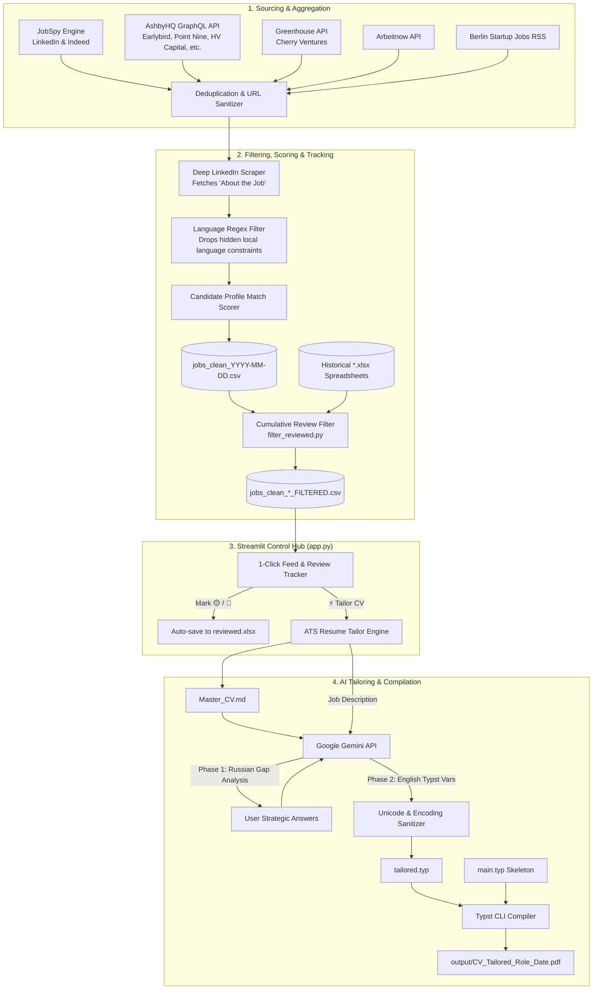

# 📚 Job-Flow Automator — Comprehensive Technical Documentation

Welcome to the comprehensive architectural and operational documentation for **Job-Flow Automator**. This document provides an exhaustive breakdown of the system architecture, component lifecycles, data contracts, custom scrapers, AI prompt engineering, and extension guidelines.

---

## 📑 Table of Contents
1. [System Overview & Philosophy](#1-system-overview--philosophy)
2. [End-to-End Architecture](#2-end-to-end-architecture)
3. [Component Deep-Dive](#3-component-deep-dive)
   - [3.1 Scraper & VC Connector Engine (`main.py`, `custom_boards.py`)](#31-scraper--vc-connector-engine)
   - [3.2 Language & Relevance Filter Engine (`config.py`)](#32-language--relevance-filter-engine)
   - [3.3 Cumulative Review Tracker (`filter_reviewed.py`)](#33-cumulative-review-tracker)
   - [3.4 Streamlit Control Dashboard (`app.py`)](#34-streamlit-control-dashboard)
   - [3.5 2-Phase Gemini ATS Tailoring Engine (`prompt.md`)](#35-2-phase-gemini-ats-tailoring-engine)
   - [3.6 Typst PDF Typesetting Engine (`main.typ`, `tailored.typ`)](#36-typst-pdf-typesetting-engine)
4. [Data Schemas & Contracts](#4-data-schemas--contracts)
5. [Customization & Extension Manual](#5-customization--extension-manual)
   - [Adding a New VC / Company Board](#adding-a-new-vc--company-board)
   - [Adding Language Exclusion Filters](#adding-language-exclusion-filters)
   - [Customizing the Typst Resume Skeleton](#customizing-the-typst-resume-skeleton)
6. [Troubleshooting & Maintenance](#6-troubleshooting--maintenance)

---

## 1. System Overview & Philosophy

**Job-Flow Automator** is designed around three core principles:
1. **Zero-API-Cost Data Sourcing:** Aggregate high-signal tech postings without paid third-party API subscriptions (e.g. ScraperAPI, BrightData, paid job search APIs).
2. **Human-in-the-Loop Workflow:** Avoid blind auto-applying. Provide ultra-fast 1-click verification tools to inspect live postings and generate tailored resumes on-demand.
3. **Deterministic ATS Optimization:** Produce 1-page, high-density, strictly valid Typst PDFs that parse reliably into Applicant Tracking Systems (Workday, Greenhouse, Ashby, Lever).

---

## 2. End-to-End Architecture



---

## 3. Component Deep-Dive

### 3.1 Scraper, VC & Scaleup Direct API Connectors
* **`main.py`:** Orchestrates the multi-source pipeline, handling query batching, random rate-limit jitter (1.5–3 seconds), Real-time live streaming (`jobs_live_stream.csv`), fast 5-thread LinkedIn enrichment, and timestamped exports.
* **`custom_boards.py`:**
  - **AshbyHQ Posting APIs:** High-speed REST connectors fetching directly from leading AI scaleups and tech platforms (`n8n`, `ElevenLabs`, `PostHog`, `Linear`, `Sentry`, `Perplexity AI`, `Langfuse`, `Modal Labs`, `OpenAI`).
  - **Greenhouse Public Boards APIs:** Official API connectors for top European VC portfolios and unicorns (`Cherry Ventures`, `N26`, `Celonis`, `Contentful`, `Trade Republic`, `Figma`, `Stripe`).
  - **Arbeitnow API:** Queries `https://arbeitnow.com/api/job-board-api` for German and Remote European tech roles.
  - **BSJ RSS:** Real-time XML feed parser for `https://berlinstartupjobs.com/feed/`.

### 3.2 Language, Geographic & Multi-Track Relevance Filter Engine
* **`config.py`:** Holds all configurable parameters:
  - `TARGET_LOCATIONS` & `is_valid_location()`: Strict geographic validator ensuring roles are in Berlin/Potsdam or accessible Remote (EU/Germany/Worldwide), while filtering out non-Berlin hybrid/onsite roles and US/UK-restricted listings.
  - `EXCLUDE_TITLE_KEYWORDS`: Drop Senior/C-level, developer, accounting, or internship roles.
  - `ACTIVE_LANGUAGE_PATTERNS`: Regex patterns that scan descriptions for phrases like `fluent german`, `C1 niveau`, `muttersprache`, `deutschkenntnisse erforderlich`.
  - `SCORING_TRACKS` & `evaluate_job_match()`: Multi-track weighted scoring engine with word-boundary regexes, title bonuses, signature tool tiers, negative requirement penalties, and skill tag extraction across 4 tracks:
    1. *AI & Workflow Automation* (n8n, Make, Zapier, LLM, Prompt Engineering, Solutions Eng).
    2. *Technical Operations & Deployment* (Deployment, IT Support, Troubleshooting, System Integration).
    3. *Media, AV & Livestream Operations* (vMix, OBS Studio, NDI, Audiovisual, Webinar/Broadcast).
    4. *Workplace & Operations Generalist* (Workplace Experience, Front Desk, People Ops).

### 3.3 Cumulative Review Tracker
* **`filter_reviewed.py`:**
  - Scans **all** `.xlsx` files in the workspace (and subfolders `history/`, `archive/`).
  - Detects reviewed rows via:
    1. **Cell background color fill** (across any column, supporting Excel/Google Sheets RGB, Theme, and Indexed fills).
    2. **Status keywords** (`Applied`, `Rejected`, `Interview`, `Отклик`, `Отказ`, `Просмотрено`).
    3. **Registry files** (`reviewed.xlsx`, `applied.xlsx`, `history.xlsx`).
  - Uses **Dual-Key Matching**:
    - Normalized clean URL (`clean_job_url`).
    - Normalized Title + Company (`normalize_text_for_dedup(title) + "_" + normalize_text_for_dedup(company)`).

### 3.4 Streamlit Control Dashboard
* **`app.py`:**
  - Provides a unified web UI running on `localhost:8501`.
  - **Tab 1:** Job feed with 1-click external URL links, instant status marking (`🟡 Rejected`, `🔵 Applied`), and 1-click transfer to the CV Tailor.
  - **Tab 2:** 2-Phase ATS tailoring interface with live Typst compilation and download button.
  - **Tab 3:** In-browser scraper execution with live terminal log streaming.
  - **Tab 4:** Documentation and template status dashboard.

### 3.5 2-Phase Gemini ATS Tailoring Engine (Bilingual: EN / DE)
* **`prompt.md` / `app.py`:**
  - **Bilingual Capabilities:** Supports tailoring resumes in both **English** (`main.typ`, `Master_CV.md`) and **German** (`main_de.typ`, `Master_CV_DE.md`) with one-click toggles.
  - **Phase 1 (Russian):** Gap analysis comparing Master CV against the target Job Description + up to 3 strategic clarification questions (software gaps, soft skill framing, corporate vs. startup tone).
  - **Phase 2 (English or German Typst):** Generates 4 variables for `tailored.typ`:
    - `#let target-role = "..."`
    - `#let summary = [...]`
    - `#let skills = [...]`
    - `#let experience = [...]`
  - **Sanitization Pipeline:** Converts non-breaking unicode hyphens (`\u2011`, `\u2013`) to ASCII hyphens (`-`), replaces vertical pipes with middle dots (` · `), and strips markdown wrappers.

### 3.6 Typst PDF Typesetting Engine
* **`main.typ` & `main_de.typ`:** Canonical layout skeletons for English and German with A4 geometry, margin budget (`x: 1.2cm, top: 0.85cm, bottom: 0.85cm`), Liberation Sans typography, localized header contacts, education, and static projects.
* **`tailored.typ`:** Dynamically overwritten by the AI on each run with target language variables.
* **`typst compile main.typ output/CV_...pdf`:** Compiles pixel-perfect 1-page PDFs in under 150 milliseconds.

---

## 4. Data Schemas & Contracts

### Scraped Job Record Schema (CSV)
| Column Name | Data Type | Description |
| :--- | :--- | :--- |
| `match_score` | `Integer (0-100)` | Relevance score calculated against `PROFILE_KEYWORDS`. |
| `category` | `String` | Search category bucket (e.g. `AI Operations`). |
| `title` | `String` | Job title as listed on the source site. |
| `company` | `String` | Hiring company or portfolio name. |
| `contact_email` | `String` | Extracted recruiter/founder email address(es). |
| `location` | `String` | City, country, or remote specification. |
| `site` | `String` | Source platform (`linkedin`, `indeed`, `ashby_vc`, etc.). |
| `search_query` | `String` | The specific query string that discovered this job. |
| `job_url` | `String` | Direct application / posting URL. |
| `date_posted` | `String` | Publication date from the source. |
| `description` | `String` | Full description text (enriched from LinkedIn if applicable). |

---

## 5. Customization & Extension Manual

### Adding a New VC / Company Board
To add a new Ashby-hosted venture capital fund, add a tuple `('Fund Name', 'board_subdomain')` to `custom_boards.py`:
```python
boards = [
    ('Earlybird VC', 'earlybird'),
    ('Index Ventures', 'indexventures'),  # Added new fund
]
```

### Adding Language Exclusion Filters
To switch language exclusion (e.g. for Spain or France), edit `config.py`:
```python
ACTIVE_LANGUAGE_PATTERNS = SPANISH_REGEX_PATTERNS  # Or FRENCH_REGEX_PATTERNS
```

### Customizing the Typst Resume Skeleton
Edit `main.typ` (or `templates/main.template.typ`):
- Change header contacts, links, and work authorization notes.
- Add or modify static sections (e.g. `= Certifications`, `= Selected Publications`).

---

## 6. Troubleshooting & Maintenance

| Symptom | Root Cause | Solution |
| :--- | :--- | :--- |
| `LinkedIn 429 Too Many Requests` | Rapid consecutive scraping requests | Increase sleep range in `main.py` (`time.sleep(random.uniform(4.0, 7.0))`). |
| `Typst CLI Error: font not found` | `Liberation Sans` font not installed on OS | Install Liberation Sans or change font to `"Arial"` in `main.typ`. |
| `Gemini 503 Service Unavailable` | Model endpoint temporary overload | The built-in retry mechanism will retry with backoff, or switch model to `gemini-3.6-flash` or `gemini-3.1-flash-lite` in the sidebar. |
| `No jobs retrieved from Ashby/Greenhouse` | Board handle changed or API rate limit | Verify board URL in browser (`https://jobs.ashbyhq.com/{org}`). |
