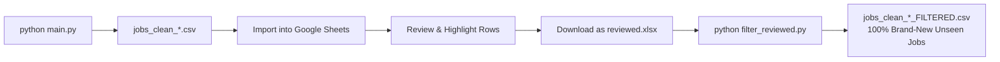

# 🎯 Smart Job Aggregator & Review Pipeline

[](https://www.python.org/downloads/)
[](LICENSE)
[]()

A **zero-API-cost**, end-to-end job aggregation and smart filtering pipeline. It collects job postings across major job boards and top VC portfolios, scrapes complete descriptions, filters out unwanted language constraints via regex, scores candidate relevance, and **cumulatively tracks previously reviewed/applied vacancies** via Excel and Google Sheets.

> **Credit & Inspiration:** This project extends and builds upon the core engine of [JobSpy](https://github.com/speedyapply/JobSpy) by adding direct VC board adapters (AshbyHQ, Greenhouse), deep description enrichment, regex-based language requirement filters, and cumulative historical review tracking.

---

## ✨ Features

- 🌐 **Multi-Source Aggregation:**
  - Scrapes **LinkedIn** & **Indeed** via `python-jobspy`.
  - Direct API connector for **AshbyHQ** (Earlybird VC, Atlantic Labs, Point Nine, HV Capital, Planet A).
  - Direct API connector for **Greenhouse** (Cherry Ventures Portfolio).
  - Direct API connector for **Arbeitnow** (Tech & English roles in EU).
  - RSS parser for **Berlin Startup Jobs**.
- 🔄 **Deep LinkedIn Enrichment:**
  - Automatically fetches the full *"About the job"* description for truncated LinkedIn preview listings, complete with a `tqdm` progress bar.
- 🧹 **Regex Language Filter:**
  - Drops jobs requiring local language fluency (e.g., German, Spanish, French) hidden in description text (e.g., *"C1 Niveau"*, *"Muttersprache"*, *"verhandlungssicher"*).
- 🎯 **Profile Match Scoring:**
  - Computes a `0-100%` relevance score based on your custom profile keywords, sorting the top matches first.
- 📧 **Direct Contact Email Extraction:**
  - Extracts recruiter and hiring manager emails from job descriptions for direct outreach.
- 🎨 **Cumulative Historical Review Tracker (`filter_reviewed.py`):**
  - Scans **all** historical `.xlsx` spreadsheets in your project.
  - Detects processed jobs by **cell background color** (Google Sheets & Excel) and **status keywords** (*Applied*, *Rejected*, *Interview*, etc.).
  - Deduplicates by both **clean URLs** and normalized **Title + Company** pairs to ensure you never review the same vacancy twice.

---

## 📁 Project Structure

```text
├── config.py             # ⚙️ Search parameters, target categories, regex language rules, skill keywords
├── main.py               # 🚀 Main orchestrator (Scrapes, Enriches, Filters, Scores, Exports CSV)
├── custom_boards.py      # 🔌 Fast API connectors for VC portfolios (Ashby, Greenhouse, Arbeitnow, BSJ)
├── filter_reviewed.py    # 🎨 Cumulative historical filter for marked/applied Excel files
├── requirements.txt      # 📦 Python dependencies
├── .gitignore            # 🛡️ Prevents accidental upload of personal CVs, CSVs, and XLSX files
└── README.md             # 📖 Documentation
```

---

## ⚡ Quick Start

### 1. Clone & Install Dependencies
```bash
git clone https://github.com/YOUR_USERNAME/job-flow-automator.git
cd job-flow-automator

pip install -r requirements.txt
```

### 2. Run the Aggregator Pipeline
```bash
python main.py
```
This generates a timestamped CSV in your project folder:
`jobs_clean_YYYY-MM-DD_HH-MM.csv`

---

## 🔄 Review & Application Workflow (Google Sheets / Excel)



1. **Import:** Open [Google Sheets](https://sheets.google.com) or Excel and import the latest `jobs_clean_*.csv`.
2. **Review & Mark:**
   - Highlight reviewed rows with **any background fill color** (e.g. Yellow for rejected, Blue for applied).
   - Or write status keywords in a column (*Applied*, *Rejected*, *Interview*, *Skip*).
3. **Export:** Download your sheet as **`.xlsx`** (`File ➔ Download ➔ Microsoft Excel (.xlsx)`).
4. **Filter:** Place the `.xlsx` file (e.g., `reviewed.xlsx`) in the project directory and run:
   ```bash
   python filter_reviewed.py
   ```
5. **Result:** The script scans **all** previous `.xlsx` files and outputs `jobs_clean_YYYY-MM-DD_HH-MM_FILTERED.csv`, containing **only brand-new, unseen vacancies**.

---

## 🌍 Adapting for Other Cities, Roles & Languages

All settings are organized in [`config.py`](config.py):

### 1. Change Location
```python
LOCATION = "Madrid, Spain"
COUNTRY_INDEED = "spain"
```

### 2. Change Language Exclusion Rules
Switch language filter presets in 1 line:
```python
# To filter out Spanish requirements (keep strictly English jobs in Spain):
ACTIVE_LANGUAGE_PATTERNS = SPANISH_REGEX_PATTERNS

# Or disable language exclusion:
ACTIVE_LANGUAGE_PATTERNS = []
```

### 3. Customize Search Categories & Exclusion Keywords
```python
SEARCH_CATEGORIES = {
    "Data & Analytics": ["Data Analyst", "Analytics Engineer", "BI Specialist"],
    "Product Management": ["Product Manager", "Associate PM", "Product Operations"]
}

EXCLUDE_TITLE_KEYWORDS = ["senior", "lead", "director", "intern"]
```

---

## ⚠️ Notes & Disclaimer

- Web scraping depends on third-party site structures. If LinkedIn or Indeed layout changes, update the underlying dependency: `pip install --upgrade python-jobspy`.
- Direct VC board connectors (AshbyHQ, Greenhouse, Arbeitnow) use stable official JSON/GraphQL endpoints.
- Residential proxies are recommended if scraping Google Jobs directly.

---

## 📄 License
This project is open-source under the [MIT License](LICENSE).
