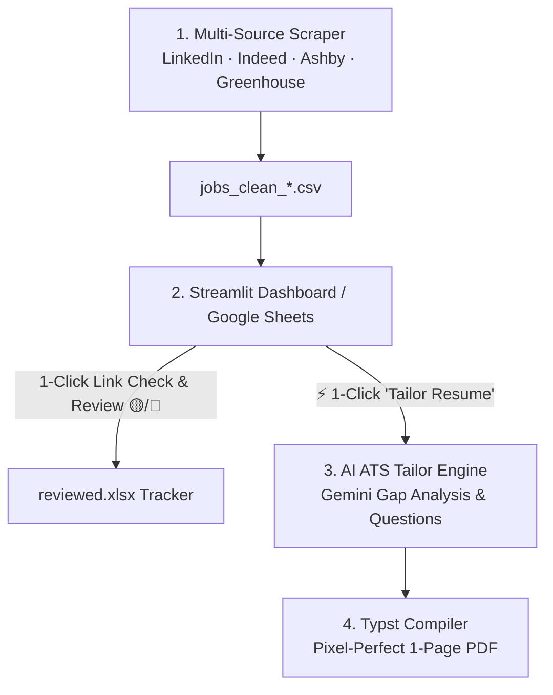

# 🎯 Job-Flow Automator

[](https://www.python.org/downloads/)
[](https://streamlit.io/)
[](https://typst.app/)
[](LICENSE)
[]()

An **All-in-One Career & Job Search Automation Suite**:
1. **Multi-Source Job Aggregator:** Scrapes LinkedIn, Indeed, VC portfolios (AshbyHQ, Greenhouse), and niche tech boards with zero scraping API cost.
2. **Smart Language & Quality Filter:** Drops jobs requiring local language fluency (German, Spanish, French) via regex, scores relevance (`0-100%`), and extracts hiring manager emails.
3. **Cumulative Application Tracker:** Seamlessly tracks reviewed/rejected/applied vacancies across Google Sheets and Excel files so you never review the same posting twice.
4. **AI-Powered ATS Resume Tailor & Typst Compiler:** Analyzes target job requirements via Google Gemini, conducts an interactive 2-phase alignment, and compiles a pixel-perfect, 1-page ATS-compliant PDF in seconds.

---

## 🔄 End-to-End Workflow



---

## ✨ Key Features

### 🌐 1. Multi-Source Job Aggregation (LinkedIn, Indeed, Google Jobs & VC Portfolios)
- **Job Boards:** Scrapes LinkedIn & Indeed via `python-jobspy`.
- **Google Jobs:** Native **Playwright Stealth** engine with anti-detection and cookie-bypass, plus optional SerpApi support.
- **VC Portfolios:** Direct official API connectors for **AshbyHQ** (Earlybird, Atlantic Labs, Point Nine, HV Capital, Planet A) and **Greenhouse** (Cherry Ventures).
- **Niche Boards:** **Arbeitnow API** & **Berlin Startup Jobs RSS**.
- **Deep LinkedIn Scraping:** Fast 5-thread concurrent fetcher for full *"About the job"* descriptions.

### 🧹 2. Smart Regex & Language Filtering
- Automatically catches and excludes hidden local language requirements (*"fluent German"*, *"C1 Niveau"*, *"Muttersprache"*, *"español imprescindible"*).
- Pre-configured presets in `config.py` for **German, Spanish, French**, or easily extensible to any language.

### 📋 3. Interactive Dashboard & Application Tracker
- **Real-Time Live Feed:** View and interact with newly discovered jobs while background queries continue.
- **1-Click Job Links:** Open postings in new browser tabs instantly.
- **Review Buttons:** Mark postings as 🟡 *Rejected* or 🔵 *Applied* with automatic persistence to `reviewed.xlsx`.
- **Cumulative Deduplication:** Scans all historical spreadsheets so old vacancies are never shown again.

### ⚡ 4. AI ATS Resume Tailor & Typst Compiler (Bilingual EN / DE)
- **Bilingual Generation:** 1-click tailored resume generation in **English** (`main.typ`) or **German** (`main_de.typ`).
- **Phase 1 (Gap Analysis):** Gemini analyzes your Master CV against the Job Description, calculates ATS Match %, and asks up to 3 strategic clarification questions.
- **Phase 2 (Typst Variable Generation):** Generates clean, sanitized Typst variables within a strict 1-page document budget.
- **Instant Compilation:** Compiles to PDF via **Typst** with high-density layout, zero margin waste, and strict ASCII encoding.

---

## 📁 Project Structure

```text
job-flow-automator/
│
├── Run_JobFlow.bat              # 🚀 1-Click Windows startup launcher
├── app.py                       # 🌐 Unified Streamlit Web Dashboard (Feed + Tailor + Scraper)
│
├── main.py                      # 🚀 Standalone Scraper Orchestrator CLI (Live streaming & fast pool)
├── google_jobs_scraper.py       # 🌐 Google Jobs Playwright Stealth & SerpApi connector
├── config.py                    # ⚙️ Search categories, regex rules, candidate keywords, location
├── custom_boards.py             # 🔌 Direct API connectors for Ashby, Greenhouse, Arbeitnow
├── filter_reviewed.py           # 🎨 Cumulative historical review filter CLI
│
├── templates/                   # 🛡️ Anonymized public templates for new users
│   ├── master_cv.template.md    # 📄 English Master CV skeleton
│   ├── master_cv_de.template.md # 📄 German Master CV skeleton
│   ├── main.template.typ        # 📐 Canonical English Typst layout
│   ├── main_de.template.typ     # 📐 Canonical German Typst layout
│   └── prompt.template.md       # 🧠 2-Phase ATS tailoring system prompt & rules
│
├── requirements.txt             # 📦 Python dependencies
├── .gitignore                   # 🔒 Protects private CVs, PDFs, XLSX, and CSVs
└── README.md                    # 📖 Documentation
```

---

## ⚡ Quick Start

### 1. Clone the Repository
```bash
git clone https://github.com/hakerishka/job-flow-automator.git
cd job-flow-automator
```

### 2. Install Dependencies & Typst
```bash
pip install -r requirements.txt
```
> **Note on Typst:** Install the free, ultra-fast [Typst CLI](https://typst.app/):
> - **Windows:** `winget install --id Typst.Typst`
> - **macOS:** `brew install typst`
> - **Linux:** `cargo install typst-cli` or download binary from [Typst Releases](https://github.com/typst/typst/releases).

### 3. Set Up Your Resume Files
Copy the templates and customize them with your experience:
1. `templates/master_cv.template.md` ➔ Save as **`Master_CV.md`** (fill in your experience bank and keywords).
2. `templates/main.template.typ` ➔ Save as **`main.typ`** (customize header contacts and static sections).

### 4. Launch Application
- **Windows (1-Click):** Double-click `Run_JobFlow.bat`.
- **Command Line:**
  ```bash
  streamlit run app.py
  ```

---

## 🌍 Adapting for Other Cities & Languages

All settings are configured in [`config.py`](config.py):

```python
# Location settings
LOCATION = "Madrid, Spain"
COUNTRY_INDEED = "spain"

# Active language exclusion filter (German, Spanish, French, or empty)
ACTIVE_LANGUAGE_PATTERNS = SPANISH_REGEX_PATTERNS

# Target search categories
SEARCH_CATEGORIES = {
    "Operations & Automation": ["Operations Specialist", "AI Automation Lead"],
    "Product & Solutions": ["Product Operations", "Solutions Architect"]
}
```

---

## 🤝 Credits & Attribution
- Core scraping engine powered by [JobSpy](https://github.com/speedyapply/JobSpy).
- Fast modern typesetting powered by [Typst](https://typst.app/).
- LLM reasoning powered by [Google Gemini](https://ai.google.dev/).

---

## 📄 License
Open-source under the [MIT License](LICENSE).
