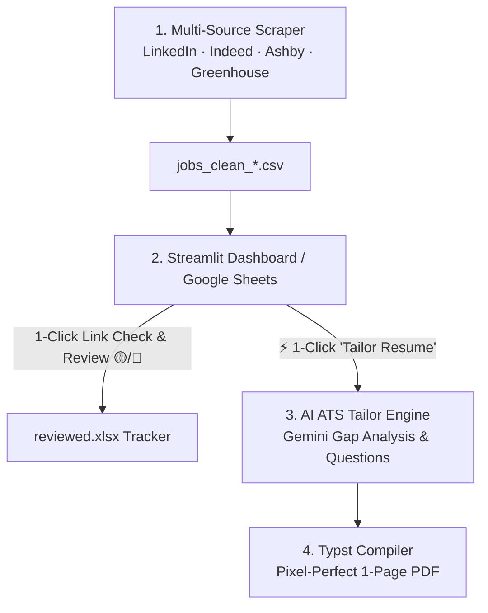

# 🎯 Job-Flow Automator

[](https://www.python.org/downloads/)
[](https://github.com/hakerishka/job-flow-automator/actions)
[](https://streamlit.io/)
[](https://typst.app/)
[](LICENSE)
[]()

An **All-in-One Career & Job Search Automation Suite**:
1. **Multi-Source Job Aggregator:** Scrapes LinkedIn, Indeed, VC portfolios (AshbyHQ, Greenhouse), and niche tech boards with zero scraping API cost.
2. **Deterministic Multi-Track Match Scoring:** Evaluates candidates across 4 distinct tracks (*AI & Automation, Tech Ops, Media AV, Workplace Ops*) using regex word boundaries, signature tool weights, and requirement penalties.
3. **Smart Language & Quality Filter:** Drops jobs requiring local language fluency (German, Spanish, French) via regex, validates geographic bounds (Berlin/Potsdam & EU Remote), and extracts hiring manager emails.
4. **Cumulative Application Tracker:** Seamlessly tracks reviewed/rejected/applied vacancies across Google Sheets and Excel files so you never review the same posting twice.
5. **AI-Powered ATS Resume Tailor & Typst Compiler:** Analyzes target job requirements via Google Gemini, conducts an interactive 2-phase alignment, and compiles a pixel-perfect, 1-page ATS-compliant PDF in seconds.

---

## 🔄 End-to-End Workflow



---

## ✨ Key Features

### 🌐 1. Multi-Source Job Aggregation (LinkedIn, Indeed, VC Portfolios & Scaleup APIs)
- **Job Boards:** Scrapes LinkedIn & Indeed via `python-jobspy`.
- **AshbyHQ API Connectors:** Direct, official APIs for leading AI and tech scaleups (**n8n, ElevenLabs, PostHog, Linear, Sentry, Perplexity AI, Langfuse, Modal, OpenAI**).
- **Greenhouse API Connectors:** Direct, official APIs for top VC portfolios and European unicorns (**Cherry Ventures, N26, Celonis, Contentful, Trade Republic, Figma, Stripe**).
- **Niche Tech Boards:** **Arbeitnow API** & **Berlin Startup Jobs RSS**.
- **Deep LinkedIn Scraping:** Fast 5-thread concurrent fetcher for full *"About the job"* descriptions.

### 🎯 2. Deterministic Multi-Track Scoring & Geo Filtering
- **4 Career Tracks:** AI Automation, Technical Operations & Deployment, Media/AV & Livestream, and Workplace Operations.
- **Word-Boundary Regexes:** Eliminates false positives (`ai` in `email`, `av` in `have`, `obs` in `obstacle`).
- **Geographic Validation:** Accepts target hubs (Berlin, Potsdam) and accessible remote (Germany, Europe, Worldwide) while rejecting non-Berlin hybrid/onsite listings.

### 📋 3. Interactive Dashboard & Application Tracker
- **Real-Time Live Feed:** View and interact with newly discovered jobs with PID process-level activity detection.
- **Track Filters & Skill Tags:** Filter jobs by career track and view matched skill chips (`n8n`, `vMix`, `Troubleshooting`).
- **1-Click Job Links & Review Buttons:** Mark postings as 🟡 *Rejected* or 🔵 *Applied* with automatic persistence to `reviewed.xlsx`.
- **Cumulative Deduplication:** Scans all historical spreadsheets so old vacancies are never shown again.

### ⚡ 4. AI ATS Resume Tailor & Typst Compiler (Bilingual EN / DE)
- **Bilingual Generation:** 1-click tailored resume generation in **English** (`main.typ`) or **German** (`main_de.typ`).
- **Phase 1 (Gap Analysis):** Gemini analyzes your Master CV against the Job Description, calculates ATS Match %, and asks up to 3 strategic clarification questions.
- **Phase 2 (Typst Variable Generation):** Generates clean, sanitized Typst variables within a strict 1-page document budget.
- **Instant Compilation:** Compiles to PDF via **Typst** with high-density layout, zero margin waste, and strict ASCII encoding.

---

## 📁 Project Structure

```text
job-flow-automator/
│
├── .github/
│   ├── workflows/ci.yml         # ⚙️ GitHub Actions CI pipeline (Ubuntu & Windows, Py 3.10-3.12)
│   └── ISSUE_TEMPLATE/          # 📝 Bug report and feature request templates
│
├── tests/                       # 🧪 Comprehensive Pytest suite (60+ unit & integration tests)
│   ├── conftest.py              # 🧩 Shared fixtures & API mocks
│   ├── test_config.py           # 🔍 Location, language regex, and title filter tests
│   ├── test_scoring.py          # 🎯 Multi-track scoring and penalty tests
│   ├── test_custom_boards.py    # 🔌 Ashby, Greenhouse, Arbeitnow mock tests
│   └── test_pipeline.py         # 🧹 URL sanitization, deduplication, and helper tests
│
├── Run_JobFlow.bat              # 🚀 1-Click Windows startup launcher
├── app.py                       # 🌐 Unified Streamlit Web Dashboard (Feed + Tailor + Scraper)
├── main.py                      # 🚀 Scraper Orchestrator CLI with live stream & process lock
├── config.py                    # ⚙️ Multi-track scoring rules, geo filter, regex patterns
├── custom_boards.py             # 🔌 Direct API connectors for Ashby, Greenhouse, Arbeitnow
├── filter_reviewed.py           # 🎨 Cumulative historical review filter CLI
│
├── templates/                   # 🛡️ Anonymized public templates for new users
│   ├── master_cv.template.md    # 📄 English Master CV skeleton
│   ├── master_cv_de.template.md # 📄 German Master CV skeleton
│   ├── main.template.typ        # 📐 Canonical English Typst layout
│   ├── main_de.template.typ     # 📐 Canonical German Typst layout
│   └── prompt.template.md       # 🧠 2-Phase ATS tailoring system prompt & rules
│
├── pyproject.toml               # 📦 Standard Python project metadata and tool configs
├── pytest.ini                   # 🧪 Pytest configuration
├── requirements.txt             # 📦 Core production dependencies
├── requirements-dev.txt         # 🛠️ Development & testing dependencies
├── CONTRIBUTING.md              # 🤝 Contribution guidelines
├── SECURITY.md                  # 🔒 Security and vulnerability policy
├── CHANGELOG.md                 # 📜 Semantic version history
└── README.md                    # 📖 Project documentation
```

---

## ⚡ Quick Start

### 1. Clone the Repository
```bash
git clone https://github.com/hakerishka/job-flow-automator.git
cd job-flow-automator
```

### 2. Install Dependencies & Typst
```bash
pip install -r requirements.txt
```
> **Note on Typst:** Install the free, ultra-fast [Typst CLI](https://typst.app/):
> - **Windows:** `winget install --id Typst.Typst`
> - **macOS:** `brew install typst`
> - **Linux:** `cargo install typst-cli` or download from [Typst Releases](https://github.com/typst/typst/releases).

### 3. Set Up Your Resume Files
Copy the templates and customize them with your experience:
1. `templates/master_cv.template.md` ➔ Save as **`Master_CV.md`** (fill in your experience bank and keywords).
2. `templates/main.template.typ` ➔ Save as **`main.typ`** (customize header contacts and static sections).

### 4. Launch Application
- **Windows (1-Click):** Double-click `Run_JobFlow.bat`.
- **Command Line:**
  ```bash
  streamlit run app.py
  ```

---

## 🧪 Running Tests & Quality Checks

Install development dependencies and run the test suite:
```bash
pip install -r requirements-dev.txt
pytest tests/ -v
```

---

## 🤝 Credits & Attribution
- Core scraping engine powered by [JobSpy](https://github.com/speedyapply/JobSpy).
- Fast modern typesetting powered by [Typst](https://typst.app/).
- LLM reasoning powered by [Google Gemini](https://ai.google.dev/).

---

## 📄 License
Open-source under the [MIT License](LICENSE).
